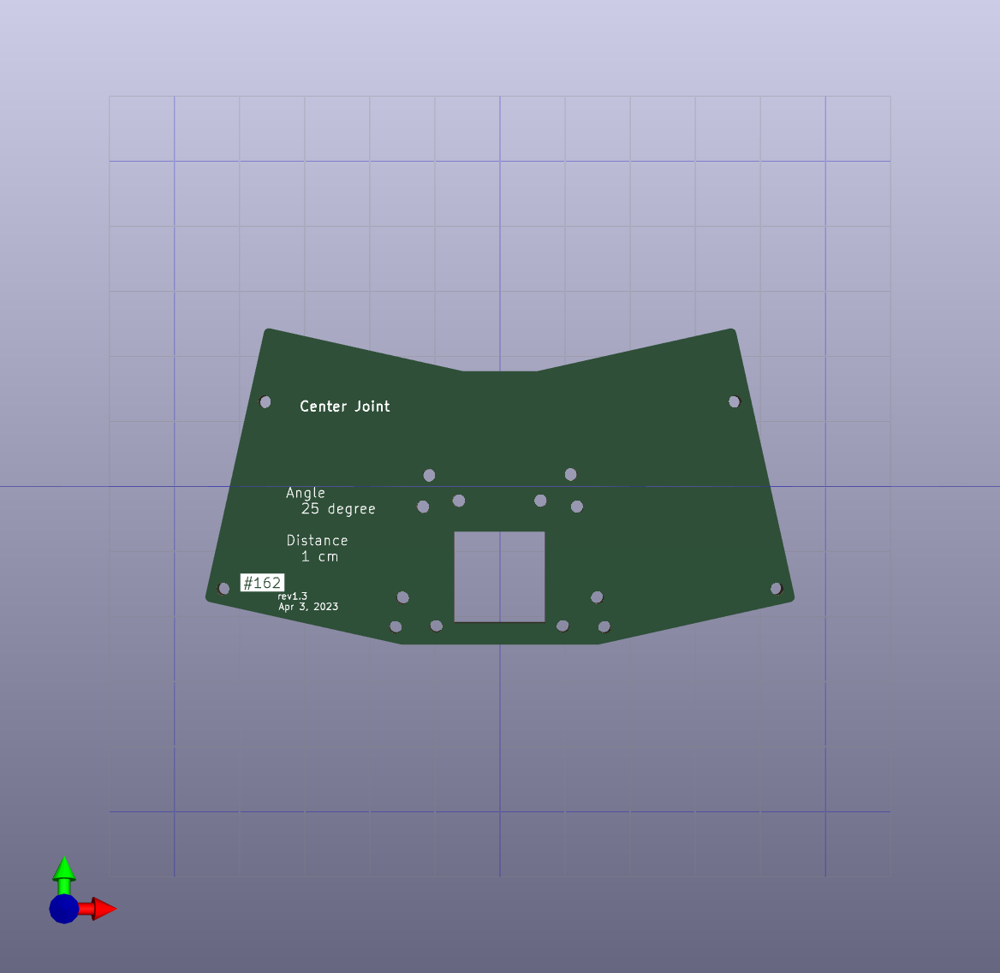
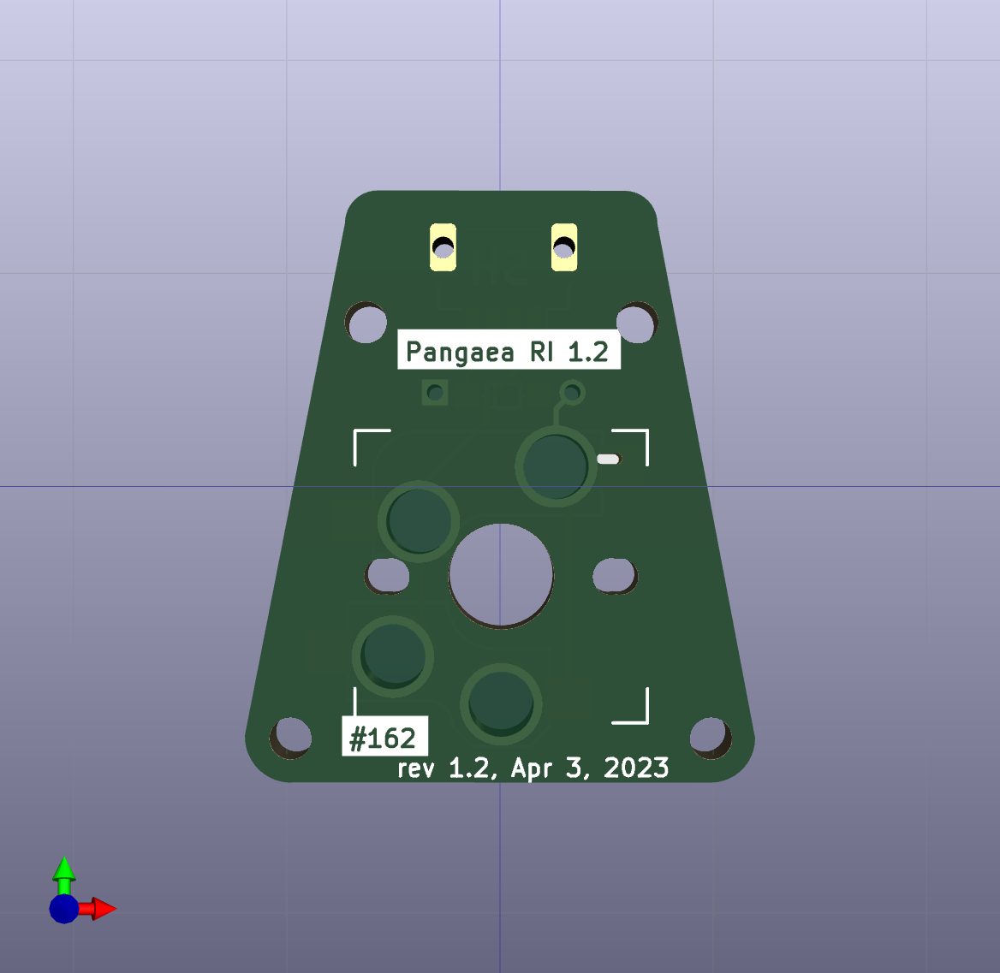

# Center joint part for Pangaea RI 1.2

This joint part is for Pangaea RI 1.2. It allows the left and right keyboards to be connected and used as an integrated unit. The angle is 12.5° for each side and 25° for the left and right sides combined.
A switch can also be fitted in the middle of the part. The switch can be attached to the Pangaea function key connector on the wiring and can be used as a Mute/Unmute for remote work, for example.

## top plate

## switch PCB

